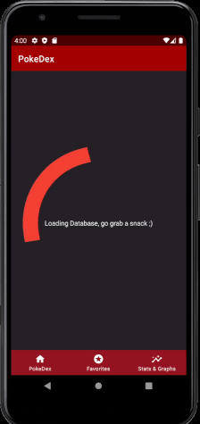
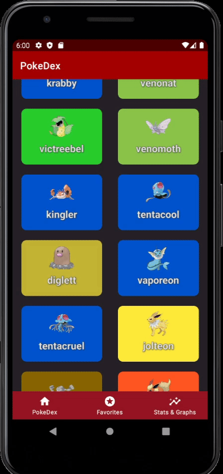
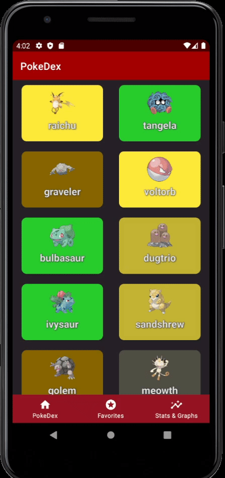
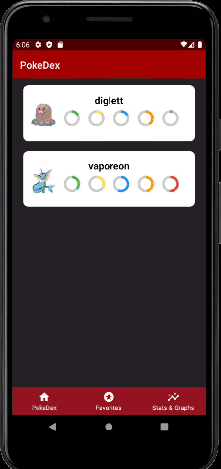

# IKPMD - PokeDex


**Nehir en Yassir**

31-1-2021

IKPMD periode 2 - Eerste gelegenheid

#

# Inhoudsopgave

- [Inleiding](#inleiding)
- [Bronnen](#bronnen)
- [Projectstructuur & Extra functies](#projectstructuur--extra-functies)
  * [Fragments & Mainactivity](#fragments--mainactivity)
  * [Fragment navigatie](#fragment-navigatie)  
- [Schermen](#schermen)
  * [Loading DB](#loading-db)  
    + [XML](#xml)
    + [Java](#java)
  * [PokeDex](#pokedex)  
    + [XML](#xml-1)
    + [Java](#java-1)
  * [Favorites](#favorites)  
    + [XML](#xml-2)
    + [Java](#java-2) 
  * [Pokedetails](#pokedetails)  
    + [XML](#xml-3)
    + [Java](#java-3)    
  * [Graphs](#graphs)  
    + [XML](#xml-4)
    + [Java](#java-4)    
- [Databases](#databases)
  * [Lokale Database](#lokale-database)
  * [Firebase](#firebase)  
- [Assets](#assets)
  * [Muziek](#muziek)
  * [Afbeeldingen](#afbeeldingen)  
  * [Kleuren](#kleuren)
  * [Libraries](#libraries)  
  * [Maven](#maven)

----------

# Inleiding
De app die in dit verslag beschreven is is een pokedex van alle eerste generatie Pokemen. Deze app is gebouwd voor API 30 en is getest op een Google Pixel 3A. In GIT hebben wij alles in de master branche gedaan, dus het was een shitshow. Maar het heeft enigzins gewerkt. Als er vragen of opmerkingen zijn schiet een issue is of contact s1113405@student.hsleiden.nl.

Features:
- Het zien van alle first gen pokemen
- Stats, geluiden en afbeeldingen van alle first gen pokemon zijn inzichtelijk
- Pokemon kunnen worden toegevoegd en verwijdert van Favorites
- Lokale database wordt gevuld met API calls
- Firebase wordt gevuld met Favorites
- Er is een graph fragment met allerlei statestieken

Known bugd:
- Soms is de Loading DB fragment eerder klaar dan de setGridFillables functie. Dit heeft te maken met het feit dat thread states niet zo heel lekker gemonitoord kunnen worden. Met meer tijd is het waarschijnlijk te fixen, ik heb voor nu een timer gehardcode op 90 seconden. Als je na de loading DB screen een pokedex krijgt met witte achtergrond en alleen maar bulbasaurs. Start dan de app opnieuw op door naar de AVD home screen te gaan, en je app handmatig te openen. Als je dat doet dan laden de grid items in.
- In de graphs staan niet alle types verwerkt omdat er ongeveer 20 types zijn. Dat zou nooi passen. Dus zijn alleen de base types uitgekozen.

----------


# Bronnen
- Voor de opmaak van de MD: https://gist.githubusercontent.com/jonschlinkert/ac5d8122bfaaa394f896/raw/bd1106691cf344e972f575c49ba3cf281beeb9b3/markdown-toc_repeated-headings.md
- Voor de inspiratie: https://github.com/skydoves/Pokedex
- RestFULL-API: https://pokeapi.co/
- API Wrapper: https://github.com/PokeAPI/pokekotlin
- Favorite button: https://github.com/IvBaranov/MaterialFavoriteButton
- Grids: https://stackoverflow.com/questions/27908680/how-lists-specifically-recyclerview-with-cardviews-in-android-work#
- Fragment navigation issue: https://github.com/android/architecture-components-samples/issues/530
- Graphs: https://github.com/jjoe64/GraphView
- Pokemon sounds: https://veekun.com/dex/downloads#other-files
- Images: https://pokeres.bastionbot.org/images/pokemon/1.png

----------

# Projectstructuur & Extra functies
## Fragments & Mainactivity
Alle fragments communiceren via de mainactivity. Hieronder is een schematische weergave gegeven van de werking van de communicatie tussen de fragments en de mainactivity. De navigatie tussen de fragments is anders geregeld, dat is in het volgende subkopje gedefineerd.


## Fragment navigatie
De volgende statements worden gebruikt om van de een naar de andere fragment te navigeren, do note dat deze snippets in de mainactivity staan en ook vanuit daar aangeroepen worden.
- makes sure app starts with loading DB screen
```
  try {
       FragmentTransaction ft = getSupportFragmentManager().beginTransaction();
       ft.replace(R.id.nav_host_fragment, d);
       ft.setTransition(FragmentTransaction.TRANSIT_FRAGMENT_FADE);
       ft.addToBackStack(null);
       ft.commit();
  } catch (Exception e) {
       e.printStackTrace();
  }
```  
De fragments zijn als variabelen gedefineerd bovenaan de mainactivity:
 ```
 Fragment a = new PokeDetails();
 Fragment b = new FavoritesFragment();
 Fragment d = new LoadingDBFragment();
 Fragment e = new NavHostFragment();
 Fragment f = new GraphFragment();
 ```
 
Door deze fragments bovenaan te defineren kan je gemakkelijk de try catch statement afstellen op de juiste fragment. Echter bleek gedurende het project dat de navigationbar onderaan de mainactivity problemen opleverde. De states van de fragments werden niet onthouden waardoor functies zoals SetGridFillables niet goed werkten. Google wilde de problemen niet fixen, omdat ze vonden dat het een feature was, en niet een bug. De originele github issue is te vinden in de bronnen https://github.com/android/architecture-components-samples/issues/530. Om dit probleem te fixen is het volgende stuk code geimplementeerd in de Onstart():

        BottomNavigationView botnav = findViewById(R.id.nav_view);
        GridLayout mainGrid = findViewById(R.id.mainGrid2);
        botnav.setOnNavigationItemSelectedListener(new BottomNavigationView.OnNavigationItemSelectedListener() {
            @Override
            public boolean onNavigationItemSelected(@NonNull MenuItem item) {
                switch (item.getItemId()) {
                    case R.id.navigation_home:
                        //println("Yes a mattie");
                        fm.beginTransaction().replace(R.id.nav_host_fragment, e, "1").show(e).commit();
                        mainGrid.setClickable(true);
                        mainGrid.setVisibility(View.VISIBLE);

                        return true;
                    case R.id.navigation_dashboard:
                        //System.out.println("Yes a mattie");
                        fm.beginTransaction().replace(R.id.nav_host_fragment, b, "2").show(b).commit();
                        mainGrid.setClickable(false);
                        mainGrid.setVisibility(View.INVISIBLE);

                        return true;
                    case R.id.navigation_graph:
                        //System.out.println("Yes a mattie");
                        fm.beginTransaction().replace(R.id.nav_host_fragment, f, "3").show(f).commit();
                        mainGrid.setClickable(false);
                        mainGrid.setVisibility(View.INVISIBLE);


                        return true;
                }
                return false;
            }
        });

Daarnaast is er ook nog een stukje code ingebouwd voor het geval dat een user de "Go Back" knop gebruikt op zijn/haar telefoon. In essentie zorgt de code snippet hieronder ervoor dat er altijd terug gegaan wordt naar de main grid met alle first gen pokemen:
```
   // IF THE ANDROID BACK BUTTON IS CLICKED DO THIS PLEASE
    @Override
    public void onBackPressed() {
        try {
            FragmentTransaction ft = getSupportFragmentManager().beginTransaction();
            ft.replace(R.id.nav_host_fragment, e);
            ft.setTransition(FragmentTransaction.TRANSIT_FRAGMENT_FADE);
            ft.addToBackStack(null);
            ft.commit();
            GridLayout mainGrid = findViewById(R.id.mainGrid);
            mainGrid.setClickable(true);
            mainGrid.setVisibility(View.VISIBLE);
        } catch (Exception e) {
            setContentView(R.layout.fragment_loading_d_b);
            messWithFirebase();
        }


    }
```

----------


# Schermen
## Loading DB
Deze fragment is een loading screen. Tijdens de zichtbaarheid van deze loading screen worden de API calls gemaakt. Klik op de GIF hieronder voor een demo:

[](https://www.youtube.com/watch?v=9nxdhsyUO7g)

### XML

### JAVA
Op de achtergrond wordt tijdens deze fragment de functie valuesToDB gerunned als thread. Deze functie zorgt ervoor dat er API calls worden gemaakt naar de PokeAPI, en de data in de lokale database wordt opgeslagen. Dit moet allemaal gedaan worden terwijl dat de Loading DB fragment draait. In de Oncreate wordt de loading DB fragment geinitialiseerd op de manier zoals bij [Fragment navigatie](#fragment-navigatie) te zien was. Verder wordt de functie valuesToDB in de onStart aangeroepen:
```
        //MainActivity dbhelper = this;
        DatabaseHelper dbHelper2 = DatabaseHelper.getHelper(this);

        if (dbHelper2.getProfilesCount(DatabaseInfo.PokemonTable.POKEMONTABLE) == 151) {

            try {
                FragmentTransaction ft = getSupportFragmentManager().beginTransaction();
                ft.replace(R.id.nav_host_fragment, e);
                ft.setTransition(FragmentTransaction.TRANSIT_FRAGMENT_FADE);
                ft.addToBackStack(null);
                ft.commit();


            } catch (Exception e) {
                e.printStackTrace();
            }
            setGridFillables();
        } else {
            if (d.isAdded()) {
                Runnable backGroundRunnable = new Runnable() {
                    public void run() {
                        try {
                            valuesToDB();

                            runOnUiThread(new Runnable() {
                                @Override
                                public void run() {
                                    try {
                                        //Thread.sleep(30000);
                                        setGridFillables();
                                    } catch (Exception e) {
                                        e.printStackTrace();
                                    }
                                }
                            });


                        } catch (Exception e) {
                            e.printStackTrace();
                        }
                    }
                };
                Thread sampleThread = new Thread(backGroundRunnable);
                sampleThread.start();
            }
        }

        if(e.isAdded()){
            setGridFillables();
        }
```        

Verder is de enige java die ertoe doet de parent klasse (de standaard voor fragments) en welke XML-layout is gekozen:
```
public class LoadingDBFragment extends Fragment {


    @Override
    public View onCreateView(LayoutInflater inflater, ViewGroup container,
                             Bundle savedInstanceState) {
        // Inflate the layout for this fragment
        return inflater.inflate(R.layout.fragment_loading_d_b, container, false);
    }


}
```
----------

## PokeDex
Deze fragment bevat een grid van alle first gen pokemon. Klik op de GIF hieronder voor een demo:

[](https://www.youtube.com/watch?v=XdETn0bsa0E)
### XML
De XML layout voor de pokedex is straight foward. Je hebt een scrollview om te scrollen, met daarin een lineair layout, waar dan weer een grid layout in zit.
In de grid layout zitten 151 cardviews, waarin dan weer de imageviews en textviews zitten. De ID's voor deze cardviews en de child nodes ervan zijn semi-hardcoded met Excel en android studioshortcuts om het proces wat sneller te maken.
Zo ziet een cardview + child nodes eruit:
```
<androidx.cardview.widget.CardView
                android:id="@+id/pokecard1"
                android:layout_width="30dp"
                android:layout_height="30dp"
                android:layout_rowWeight="1"
                android:layout_columnWeight="1"
                android:layout_marginLeft="16dp"
                android:layout_marginRight="16dp"
                android:layout_marginBottom="20dp"
                android:elevation="4dp"
                android:onClick="Switcher_main_to_poke"
                app:cardCornerRadius="10dp"
                tools:ignore="OnClick">

                <LinearLayout
                    android:layout_width="match_parent"
                    android:layout_height="wrap_content"
                    android:layout_margin="10dp"
                    android:orientation="vertical"
                    android:weightSum="3">

                    <ImageView
                        android:id="@+id/pokeimg1"
                        android:layout_width="50dp"
                        android:layout_height="50dp"
                        android:layout_gravity="center_horizontal"
                        android:src="@drawable/bulbasaur" />

                    <com.iambedant.text.OutlineTextView
                        android:id="@+id/pokename1"
                        android:layout_width="wrap_content"
                        android:layout_height="wrap_content"
                        android:layout_gravity="center_horizontal"
                        android:padding="5dp"
                        android:text="@string/pkmn_name1"
                        android:textAlignment="center"
                        android:textColor="@android:color/black"
                        android:textSize="20sp"
                        android:textStyle="bold"
                        app:outlineColor="@color/kloteding"
                        app:outlineWidth="0.1" />

                </LinearLayout>
            </androidx.cardview.widget.CardView>
```
### JAVA
De functie in java die ertoe doet bij de homefragment is setGridFillables. Zoals de naam suggereerd wordt in deze functie alle gegevens verwerkt in de maingrid. Deze functie wordt in de onstart van de mainactivity aangeroepen. In dit hoofdstuk worden snippets gegeven van stukjes code en die worden toegelicht. Alle snippets zitten in een for loop die door 151 indeces loopt, want er zijn 151 first gen pokemen.
- Set names
```
            //set name
            String name = getAllDBItems().get(i).get(0);
            int e = i + 1;
            String textviewID = "pokename" + e;
            int resID = this.getResources().getIdentifier(textviewID, "id", getPackageName());
            TextView pokenam = findViewById(resID);
            pokenam.setText(name);
            pokenam.getText();
```
            
- Set color 
```
           String type1 = getAllDBItems().get(i).get(1);
            int q = i + 1;
            String cardviewID = "pokecard" + q;
            int resID_card = this.getResources().getIdentifier(cardviewID, "id", getPackageName());
            CardView pokecard = findViewById(resID_card);
            if(type1.equals("rock")){
                pokecard.setCardBackgroundColor(getResources().getColor(R.color.rock));
            }else if(type1.equals("ground")){
                pokecard.setCardBackgroundColor(getResources().getColor(R.color.egg_yellow));
            }else if(type1.equals("normal")){
                pokecard.setCardBackgroundColor(getResources().getColor(R.color.normal));
            }else if(type1.equals("fighting")){
                pokecard.setCardBackgroundColor(getResources().getColor(R.color.fighting));
            }else if(type1.equals("flying")){
                pokecard.setCardBackgroundColor(getResources().getColor(R.color.flying));
            }else if(type1.equals("poison")){
                pokecard.setCardBackgroundColor(getResources().getColor(R.color.poison));
            }else if(type1.equals("bug")){
                pokecard.setCardBackgroundColor(getResources().getColor(R.color.bug));
            }else if(type1.equals("ghost")){
                pokecard.setCardBackgroundColor(getResources().getColor(R.color.ghost));
            }else if(type1.equals("steel")){
                pokecard.setCardBackgroundColor(getResources().getColor(R.color.steel));
            }else if(type1.equals("???")){
                pokecard.setCardBackgroundColor(getResources().getColor(R.color.special));
            }else if(type1.equals("fire")){
                pokecard.setCardBackgroundColor(getResources().getColor(R.color.fire));
            }else if(type1.equals("water")){
                pokecard.setCardBackgroundColor(getResources().getColor(R.color.water));
            }else if(type1.equals("grass")){
                pokecard.setCardBackgroundColor(getResources().getColor(R.color.grass));
            }else if(type1.equals("electric")){
                pokecard.setCardBackgroundColor(getResources().getColor(R.color.electric));
            }else if(type1.equals("psychic")){
                pokecard.setCardBackgroundColor(getResources().getColor(R.color.psychic));
            }else if(type1.equals("ice")){
                pokecard.setCardBackgroundColor(getResources().getColor(R.color.ice));
            }else if(type1.equals("dragon")){
                pokecard.setCardBackgroundColor(getResources().getColor(R.color.dragon));
            }else if(type1.equals("dark")){
                pokecard.setCardBackgroundColor(getResources().getColor(R.color.dark));
            }else if(type1.equals("fairy")){
                pokecard.setCardBackgroundColor(getResources().getColor(R.color.fairy));
            }
```           
and so on, I think you get the idea....

----------

## Favorites
Deze fragment bevat een grid van alle favorite pokemon. Klik op de GIF hieronder voor een demo:

[](https://www.youtube.com/watch?v=pn1e-YQCuhU)
### XML
Wat betreft de XMl layout van favorites is het vrijwel hetzelfde als de maingrid. Alleen zijn er:
1. Minder cardviews per row (namelijk maar 1 ipv 2)
2. Hebben de cardviews iets meer inhoud.
Voornamelijk dat laatste heeft invloed op de layout. Er zijn progress wheels toegevoegd om de base stats van een pokemon te kunnen weergeven. Zie code snippet van de cardview:
```
            <androidx.cardview.widget.CardView
                android:id="@+id/fav1"
                android:layout_width="0dp"
                android:layout_height="50dp"
                android:layout_rowWeight="1"
                android:layout_columnWeight="1"
                android:layout_marginLeft="16dp"
                android:layout_marginRight="16dp"
                android:layout_marginBottom="20dp"
                android:elevation="4dp"
                android:onClick="Switcher_main_to_poke_fav"
                android:visibility="invisible"
                app:cardCornerRadius="10dp"
                tools:ignore="OnClick">


                <ProgressBar
                    android:id="@+id/hp1"
                    style="?android:attr/progressBarStyleHorizontal"
                    android:layout_width="40dp"
                    android:layout_height="match_parent"
                    android:layout_gravity="right"
                    android:background="@drawable/circle_shape"
                    android:indeterminate="false"
                    android:max="100"
                    android:progress="65"
                    android:progressDrawable="@drawable/circular_progress_bar"
                    android:translationX="-30dp"
                    android:translationY="10dp" />

                <ProgressBar
                    android:id="@+id/atk1"
                    style="?android:attr/progressBarStyleHorizontal"
                    android:layout_width="40dp"
                    android:layout_height="match_parent"
                    android:layout_gravity="right"
                    android:background="@drawable/circle_shape"
                    android:indeterminate="false"
                    android:max="100"
                    android:progress="65"
                    android:progressDrawable="@drawable/circular_progress_bar"
                    android:translationX="-80dp"
                    android:translationY="10dp" />

                <ProgressBar
                    android:id="@+id/spatk1"
                    style="?android:attr/progressBarStyleHorizontal"
                    android:layout_width="40dp"
                    android:layout_height="match_parent"
                    android:layout_gravity="right"
                    android:background="@drawable/circle_shape"
                    android:indeterminate="false"
                    android:max="100"
                    android:progress="65"
                    android:progressDrawable="@drawable/circular_progress_bar"
                    android:translationX="-130dp"
                    android:translationY="10dp" />

                <ProgressBar
                    android:id="@+id/def1"
                    style="?android:attr/progressBarStyleHorizontal"
                    android:layout_width="40dp"
                    android:layout_height="match_parent"
                    android:layout_gravity="right"
                    android:background="@drawable/circle_shape"
                    android:indeterminate="false"
                    android:max="100"
                    android:progress="65"
                    android:progressDrawable="@drawable/circular_progress_bar"
                    android:translationX="-180dp"
                    android:translationY="10dp" />

                <ProgressBar
                    android:id="@+id/spdef1"
                    style="?android:attr/progressBarStyleHorizontal"
                    android:layout_width="40dp"
                    android:layout_height="match_parent"
                    android:layout_gravity="right"
                    android:background="@drawable/circle_shape"
                    android:indeterminate="false"
                    android:max="100"
                    android:progress="65"
                    android:progressDrawable="@drawable/circular_progress_bar"
                    android:translationX="-230dp"
                    android:translationY="10dp" />

                <LinearLayout
                    android:layout_width="match_parent"
                    android:layout_height="wrap_content"
                    android:layout_row="0"
                    android:layout_column="11"
                    android:layout_margin="16dp"
                    android:orientation="vertical"
                    android:weightSum="3">


                    <TextView
                        android:id="@+id/favname1"
                        android:layout_width="match_parent"
                        android:layout_height="wrap_content"
                        android:layout_gravity="center_vertical"
                        android:paddingTop="0dp"
                        android:text="@string/pkmn_name1"
                        android:textAlignment="center"
                        android:textColor="@android:color/black"
                        android:textSize="15sp"
                        android:textStyle="bold" />


                    <ImageView
                        android:id="@+id/favimg1"
                        android:layout_width="50dp"
                        android:layout_height="match_parent"
                        android:layout_alignParentLeft="true"
                        android:layout_gravity="center_vertical"
                        android:paddingTop="0dp"
                        android:src="@drawable/pkmn"
                        android:translationY="-10dp" />


                </LinearLayout>

            </androidx.cardview.widget.CardView>
```            

### JAVA
De java code van deze fragment was best geinig omdat ik hier voor het eerst heb gespeeld met dynamic visibility of items. De functie die er het meeste toe doet is setFavFillables(). Deze functie maakt gebruik van gegevens die zijn meegegeven uit de pokedetailsfragment, zodat het weet welke pokemon gerendered moeten worden in de favorites. Dit doet de functie door door alle entries van een meegegeven list te loopen en deze bij onStart visible te maken in de grid (ik heb wat setters weg gelaten want anders wordt het nogal een lange snippet):
```
    public void setFavFillables(){
        GridLayout layout = getView().findViewById(R.id.mainGrid);
        int count = layout.getChildCount();
        View v = null;
        for(Object entry : allFavs){
            for(int i=0; i<FavCounter; i++) {
                v = layout.getChildAt(i);
                int e = i+1;

                String newEntry = allFavs.get(i).toString().replace("[","").replace("]","");
                String[] SplittedString = newEntry.split(", ");

                //set name
                String textviewID = "favname" + e;
                int resID = getResources().getIdentifier(textviewID, "id", getActivity().getPackageName());
                TextView pokenam = v.findViewById(resID);
                String name= SplittedString[0];
                pokenam.setText(name);
                pokenam.setTextSize(TypedValue.COMPLEX_UNIT_SP, Float.parseFloat("20"));

                //set visibility
                if(SplittedString[0] == (pokenam.getText())){
                    v.setVisibility(View.VISIBLE);
                }else{
                    v.setVisibility(View.INVISIBLE);
                }

                //set HP
                //set ATK
               
                //set spatk
                String SPATK = "spatk" + e;
                int spatkID = getResources().getIdentifier(SPATK, "id", getActivity().getPackageName());
                ProgressBar pokespatk = v.findViewById(spatkID);
                String spatk = SplittedString[3];
                //System.out.println("SPATK: " + name + spatk);
                pokespatk.setMax(194);
                pokespatk.setProgress(parseInt(spatk));
                pokespatk.setProgressTintList(ColorStateList.valueOf(parseColor("#2196F3")));


                //set def
                //set spdef
               
                //set image
                String IMG = "favimg" + e;
                int imgID = getResources().getIdentifier(IMG, "id", getActivity().getPackageName());
                ImageView pokeimg = v.findViewById(imgID);

                //System.out.println("Fatboy Slim " + );
                pokeimg.setImageResource(PokeDetails.pictureArray[PokeDetails.PokeIDs.get(pokenam.getText())-1]);

            }

        }
    }
```    

----------

## Pokedetails
Deze fragment bevat een grid van alle favorite pokemon. Klik op de GIF hieronder voor een demo:

[](https://www.youtube.com/watch?v=nC-LnVQLW-k)
### XML

### JAVA


----------

## Graphs
Deze fragment bevat een tweetal grafieken met daarin statestieken over je favorites. Klik op de GIF hieronder voor een demo:

[](https://www.youtube.com/watch?v=q6owxm8XAwI)
### XML

### JAVA

----------


# Databases
## Lokale database

## Firebase


----------

# Assets
## Muziek

## Afbeeldingen

## Kleuren

## Libraries

## Maven

----------
####
